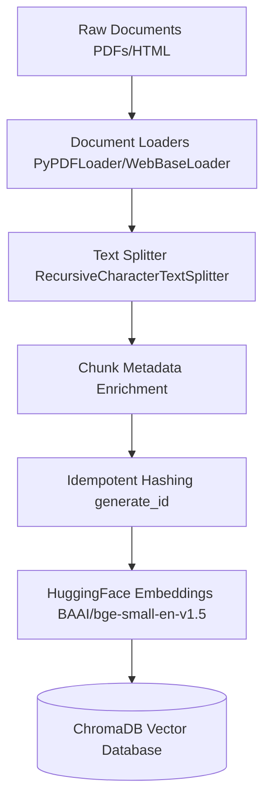

# Hybrid Search RAG System 🚀

This project implements an advanced Retrieval-Augmented Generation (RAG) system using **Hybrid Search** (Dense Vector Search + Sparse BM25 Search) combined with **Cross-Encoder Reranking**. This ensures high precision and recall for both semantic queries and exact-match keywords (like error codes or function names).

## Architecture & Data Flow

### 1. Data Ingestion Pipeline (Storing Data)

When documents are added to the system, they go through a specific preparation pipeline to ensure they are searchable:



### 2. Retrieval & Generation Pipeline (Retrieving Data)

When a user asks a question, the system searches using both keywords and semantics, reranks the results for accuracy, and generates an answer:

```mermaid
graph TD
    UserQuery[User Query] --> BM25[BM25 Retriever Keyword Search]
    UserQuery --> Vector[Chroma Vector Retriever Semantic Search]

    BM25 --> Ensemble[Ensemble Retriever RRF Fusion]
    Vector --> Ensemble

    Ensemble --> Top30[Top 30 Document Chunks]
    Top30 --> Reranker[Cross-Encoder Reranker BAAI/bge-reranker-v2-m3]
    Reranker --> Top5[Top 5 Most Relevant Chunks]

    Top5 --> Prompt[Langchain Prompt Template]
    Prompt --> LLM[Gemini 2.5 Flash LLM]   gemini-pro-latest
    LLM --> Answer[Final Answer + Citations]

    %% Observability
    LLM -.-> Langfuse[(Langfuse Observability Traces)]
```

---

## How to Execute

### 1. Setup Environment

Ensure you have Python installed, then activate your virtual environment and install the dependencies:

```bash
python -m venv venv
venv\Scripts\pip install -r requirements.txt
```

### 2. Configure API Keys

Ensure you have a `.env` file in the root directory containing your API keys:

```env
GROQ_API_KEY=your_gemini_api_key
LANGFUSE_SECRET_KEY=your_langfuse_secret
LANGFUSE_PUBLIC_KEY=your_langfuse_public
LANGFUSE_HOST=https://cloud.langfuse.com
```

### 3. Ingest Documents

Place any PDFs you want to chat with into the `data/pdfs/` folder. Run the ingestion script to process and store them in the Chroma database:

```bash
venv\Scripts\python ingest.py
```

_(Note: This process is idempotent, meaning you can safely run it multiple times without creating duplicate records.)_

### 4. Evaluate Performance

To see a benchmark of how much Hybrid + Reranking improves your retrieval over standard Vector search, run:

```bash
venv\Scripts\python evaluate.py
```

### 5. Launch the Chat Interface

Start the Streamlit application to begin chatting with your data:

```bash
venv\Scripts\streamlit run app.py
```

Open the `Local URL` provided in your terminal in any web browser.
